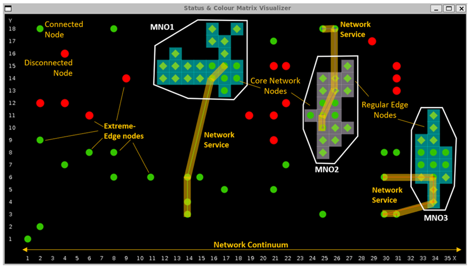
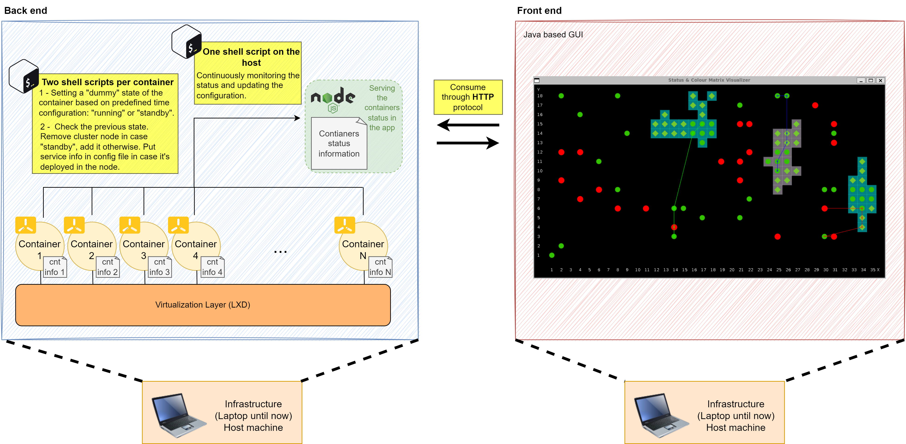

# ILE

## Table of Contents (ToC)
<!--ts-->
   * [Overview](#Overview)
      * [Back End](#Back-End)
      * [Front End](#Front-End)
   * [Usage](#Usage)
<!--te-->

## Overview

The Infrastructure Layer Emulator (ILE), is a software component that allows to emulate some of the main features of the infrastructure envisaged for the future 6G networks, namely:
- The deployment of a large number of computing nodes (the 6G orchestration systems should be able to operate on the complete network continuum, which is intrinsically large in size).
- The possibility to integrate different types of computing nodes (besides large, the network continuum is also heterogeneous).
- The emulation of different stakeholders.
- The emulation of the different network domains under consideration, i.e., core, edge, and extreme-edge domains.
- For the extreme-edge resources, the emulation of its inherent high-volatility, with devices unexpectedly connecting/disconnecting and/or changing certain properties (e.g., memory or CPU occupancy, battery level in the case of battery power devices, etc.).
- And of course, with the possibility to deploy realistic network services on such emulator.

The development of this emulator it is considered of paramount importance in order to have a kind of realistic environment on which test and demonstrate the design concepts for the future 6G M&O systems. Although still under development, an early version is already available while this document is written, with most of the features described before. Its implementation is based on the LXD [LXD], a system container and virtual machine manager that provides a unified environment for running and managing full Linux systems inside containers or virtual machines. It supports images for a large number of Linux distributions, from lightweight distributions (which are quite useful to be able to deploy a large number of Linux nodes on small-scale equipment) up to regular/complete Linux distributions (e.g., able to host and execute complex network services). LXD can scale from one instance on a single machine to a cluster emulating a full data centre, making it suitable to simulate different kind of scenarios.

A screenshot of the ILE GUI can be seen in [Figure 1](#ILEGUI), showcasing a set-up with three MNOs (white polygons) with core and edge resources each (circle and diamond nodes) and a set of extreme-edge nodes beyond the MNOs own domain. Green/red circles and diamonds within and without the MNOs are representing “actual” (containerised) Linux machines able to communicate each other and host network services. In the live set-up those extreme-edge nodes are shown asynchronously “blinking”, i.e., switching between green and red depending on its availability status (connected or disconnected). As it can be seen, three services are also shown deployed, represented by the three thick lines connecting certain nodes, and covering infrastructure resources withing and without the MNO domains. In the live PoC these lines evolve dynamically depending on the connection/disconnection status of the nodes at the extreme-edge, representing the service components re-location in real-time.

<a name="ILEGUI">Figure 1</a>: ILE Graphical User Interface (front-end) example.

As depicted in [Figure 2](#ILEcomponents), the asset is splitted in two different parts called the **back-end** and **front-end**. Both are separated in order to be able to run them on different premises, althought them could be run on the same hardware. In the back-end some information is generated and served through a nodejs instance, and then consumed by the front-end for visualizing the information and to be more intuitive for the final user.

<a name="ILEcomponents">Figure 2</a>: ILE components.

### Back End

The back-end is where the containers and VMs are executed and runnnig. Them are running over LXD, which introduces the first virtualization layer that allows to run the applications in a cloud-native fashion, apart from managing the deployment of the containers/VMs in an intuitive manner. Additionally, once the containers are up and running, the emulation could be considered as started.

As explained in the previous image, each container has a couple of shell scripts attached, both are explained below:
- For changing the container status from on to off and viceversa. This process of turning on and off the container does not "shutdown" the contaier and "boot up" it again. Instead, what is done is to change the value stored into a configuration file. Thus, There are a couple of directories, one for storing the configuration files **/usr/share/ils/config** and another one for storing the shell scripts (.sh files) **/usr/share/ils/bin**. 
- The other shell script is used for continuously monitor the state of the machine, if it's turned on or off. In case it has changed from "on" to "off" it removes the cluster node
 

### Front End

It's built using java, it consumes the files served by the node.js instance and uses them to show the status of the nodes and services running on top in real time.

## Usage

1 - Go to the [back-end](https://github.com/Atos-Research-and-Innovation/INFRASTRUCTURE-LAYER-EMULATOR/tree/main/back-end) directory and follow all the steps to deploy the infrastructure nodes of one emulation example.

2 - Go to the [front-end](https://github.com/Atos-Research-and-Innovation/INFRASTRUCTURE-LAYER-EMULATOR/tree/main/front-end) directory and follow all the steps to execute the java GUI.
